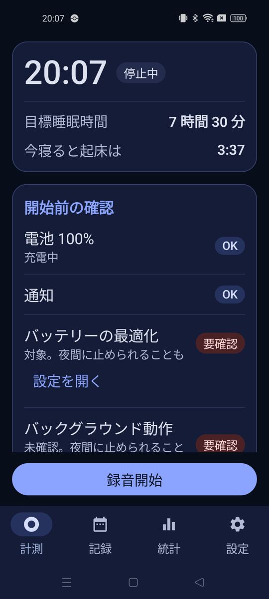
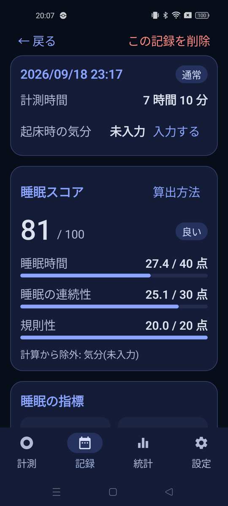
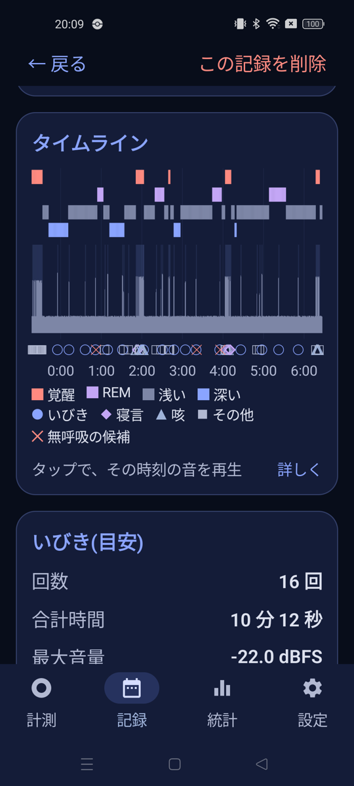
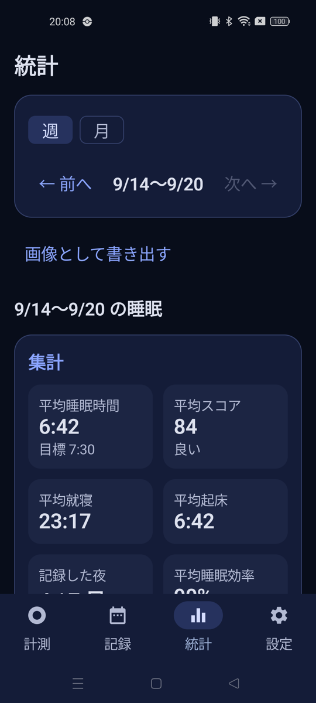

# SleepRec

枕元のスマホのマイクで一晩の睡眠を記録し、いびき・寝言・睡眠スコアを確認できる Android アプリです。
録音の解析はすべて端末の中で行い、音声を外部へ送信しません。個人開発の学習・ポートフォリオ用のプロジェクトです。

> **医療機器ではありません。** いびきや無呼吸の表示は「目安」で、診断ではありません。気になる場合は医師などに相談してください。

<table>
  <tr>
    <td align="center"><br>計測(開始前の確認)</td>
    <td align="center"><br>記録の詳細(スコア)</td>
    <td align="center"><br>タイムライン</td>
    <td align="center"><br>統計(週)</td>
  </tr>
</table>

※ 記録の詳細・統計の画面は、デバッグ用に合成したデータの表示です。

## 主な機能

**計測**
- フォアグラウンドサービスで、画面を消したまま一晩録音します。
- 計測中の画面を選べます(自動ロック / 時計付きで暗く / 完全に暗く)。終了は長押しで、誤操作を防ぎます。
- 一時停止ができます。他のアプリがマイクを使うと、自動で一時停止して通知し、空くと自動で再開します。
- 開始前に、電池・通知・バッテリー最適化・バックグラウンド動作などを確認できます。睡眠前のタグとメモを残せます。
- アプリが途中で止められた場合は、次回の起動時に、中断とその原因を案内します。

**音の検出と分類**
- 音量が閾値を超えた区間を「音声イベント」として切り出し、クリップとして保存します。
- 端末内で音響分類モデル(YAMNet)を動かし、いびき・寝言(話し声)・咳・おなら・足音・動物・その他に分類します。種別は、手動で直せます。
- いびきの回数・時間・強度と、いびきの後の長い無音による無呼吸の候補(目安)を出します。

**睡眠の推定とスコア**
- 音のイベントから、1 分ごとに覚醒/睡眠を推定し、総睡眠時間・入眠潜時・睡眠効率・中途覚醒などの指標と、100 点満点のスコアを出します。
- 睡眠ステージ(浅い/深い/REM)は、音だけからの一般的な傾向に基づく目安です。

**記録・統計**
- 睡眠曲線・音量・音のマーカーを、同じ時間軸に重ねたタイムラインを表示します。タップで、その時刻の音を再生します。
- クリップの再生(波形・音量補正つき)、端末への保存、共有、削除ができます。
- 週・月の統計(平均睡眠・就寝・起床・スコア・いびきなど)を、画像として書き出せます。

**設定**
- 目標睡眠時間、日の区切り、プロフィール(任意)、メーカー別の権限アシスタント、全録音の保存(既定はオフ)、データの削除。

## 仕組み

```
マイク → RecordingService(フォアグラウンドサービス)→ WavRecorder(AudioRecord の読み取りループ)
   ├─ 0.1 秒ごとの音量(dBFS)→ 1 秒ごとに集約 → Room
   └─ EventDetector(閾値・ヒステリシス・前後の余白)
        → イベント確定 → YamnetClassifier(LiteRT)→ 種別
        → クリップ(WAV)と Room に保存
        → 直前がいびきで、10〜90 秒の無音のあと呼吸音で再開 → 無呼吸の候補

画面(Jetpack Compose)← SleepAnalyzer / SleepScore / PeriodStats などの、純粋な関数
```

- 解析ロジックは、Android に依存しない**純粋な Kotlin の関数**として書いています。JVM のユニットテスト(225 件)で検証でき、一晩待たずに確認できます。
- DI やマルチモジュールは使わず、単一モジュールで、読みやすさを優先しています。
- 解析の閾値は、`Thresholds.kt` にまとめています(暫定値で、実データで調整する前提です)。

## 技術スタック

| 項目 | 内容 |
|---|---|
| 言語・UI | Kotlin 2.3、Jetpack Compose(BOM 2026.09.00)、Material 3 |
| 保存 | Room 2.8.5(DB v8。マイグレーションあり) |
| 画面遷移 | Navigation Compose 2.10.1 |
| 音の分類 | LiteRT 2.2.0 と YAMNet(約 4 MB。`assets` に同梱) |
| ビルド | AGP 9.4.1、Gradle 9.6.0、KSP |
| 対象 | minSdk 29(Android 10)、targetSdk 37 |

## 動かし方

**必要なもの**: 最新の Android Studio、JDK 17 以上、Android SDK 37、マイクのある実機(Android 10 以降)。

```sh
./gradlew assembleDebug        # ビルド
./gradlew installDebug         # 接続した端末にインストール
./gradlew testDebugUnitTest    # ユニットテスト
```

Android Studio で開いて、実行(▶)しても動きます。

**デバッグビルドだけの機能**(確認を早くするため)
- 保存の基準が短くなります(20 秒未満は保存しない、60 秒以上を通常の記録とします)。
- 設定タブに、8 時間前後の合成データを作る「サンプルの夜」があります。
- 記録の詳細で、クリップに「分析」ボタンが出て、モデルの出力を確認できます。計測中は、現在の音量と閾値が表示されます。

リリースビルドは、署名・難読化の設定を含めて、まだ確認していません。

`gradle.properties` の `android.uniquePackageNames=false` は、LiteRT 2.2.0 の 2 つのライブラリが同じ名前空間を使っていて、AGP 9 でビルドが失敗するのを避けるためです。

## データとプライバシー

- `INTERNET` 権限を宣言していないため、アプリから通信はできません。音声・記録・プロフィールは、端末の中にだけ保存します(`allowBackup=false`)。
- 検出したクリップは、アプリ専用の領域に保存し、7 日で自動的に削除します(スコアや音量の記録は残ります)。1 晩に音声を残すのは、最大 20 クリップまでです。
- 一晩ぶんの全録音(WAV)は、設定でオンにしたときだけ保存します。既定はオフです(8 時間で約 0.9 GB になるため)。
- 音声や画像を端末の外へ出すのは、ユーザーが「保存」「共有」を操作したときだけです(「音楽/SleepRec」「ピクチャ/SleepRec」、共有シート)。
- 設定タブから、すべてのデータを削除できます。
- ビルドに含まれるライブラリ(LiteRT)が、`RECEIVE_BOOT_COMPLETED` などの権限をマニフェストに追加しています。アプリでは使っていません。

## 精度と限界

- 音量(dBFS)は、端末のマイクの感度による**相対値**です。他の端末とは比べられません。
- 睡眠の推定は、マイクの音だけが根拠です。静かに起きていても「睡眠」になります。
- スコアの配点、閾値、無呼吸の判定(いびき後 10〜90 秒の無音)は暫定値です。**実際の一晩の録音での検証は、これからです。**
- 動作確認は、OPPO(Android 14)の 1 台で行いました。メーカー独自の省電力機能の案内のうち、他のメーカーの手順は、一般的な手順で、実機では確認していません。

## ドキュメント

| ファイル | 内容 |
|---|---|
| [docs/SPEC.md](docs/SPEC.md) | 要件(機能要件 FR・非機能要件 NFR) |
| [docs/PLAN.md](docs/PLAN.md) | 実装計画、フェーズごとの進捗、決定事項 |
| [docs/RESEARCH.md](docs/RESEARCH.md) | 調査(スコアの式、音の分類モデル) |
| [docs/UX.md](docs/UX.md) | UI/UX の設計と、画面デザインの方針 |
| [docs/GAPS.md](docs/GAPS.md) | 類似アプリとの比較による、抜け漏れの調査 |

## 開発の状況

必須の範囲(PLAN.md の Phase 0〜9)は、実装済みです。

- **未対応(拡充フェーズ)**: アラーム・スマートアラーム、スリープサウンドとの連動、Health Connect などの連携、睡眠動物、多言語化、バックアップ、睡眠前のタグ・天気などと睡眠の相関表示、リマインダー。
- **既知の課題**:
  - 実際の一晩の録音での、閾値の調整。
  - 録音を続ける WakeLock の上限が 14 時間(仕様は 20 時間)。

## ライセンス

このプロジェクトのライセンスは、まだ設定していません。
音響分類モデル YAMNet は、Apache License 2.0 です(作者の回答と、モデルファイル内のメタデータによる)。
